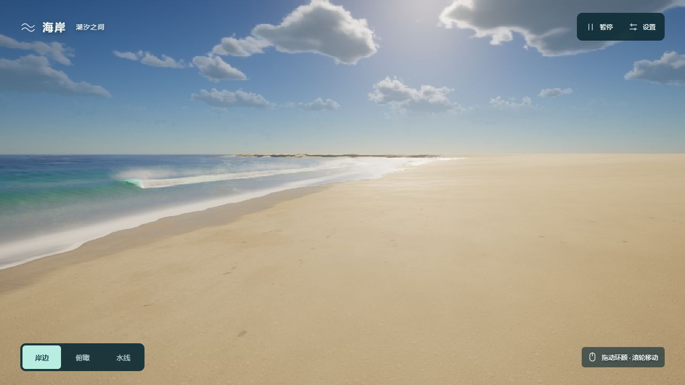

# 海岸 · 潮汐之间

全屏实时海岸：海浪涌向沙滩，碎浪形成白沫，退水留下湿沙与泡沫。紧凑沙岛上是一座夏威夷木屋，带蓝绿木板外墙、奶油色窗框、珊瑚红坡屋顶、架高木地板、露台、台阶、吊床、冲浪板、座椅和盆栽。房屋周围布置 3 棵棕榈、4 棵铁树和 3 组花草；房屋、道具及植物使用原生三维网格。

当前首页已替换“一束光”展览，使用 [Tidewater](https://dgreenheck.github.io/tidewater/) 的 MIT 开源海岸代码，保留四级联 FFT 海浪、近岸波、冲滩模拟、沙地、折射、焦散、大气与体积云。地形改为低矮圆润的沙岛，没有山体和岩石。按海平面以上地形采样统计，总干沙面积为 248 m²，房屋加露台占地为 124.8 m²，比例约为 1.987 倍；岸线采样随小岛重新计算。

这是可自由移动的海岸与房屋环境查看器；当前未包含史迪仔或其他人物模型、人物动画、房屋内部场景，以及原作的钓鱼、船只、村庄和声音。上游源码固定于 `4811ba48d795197de5621985f404e765c0b7c0ef`，来源及完整授权见 [THIRD_PARTY_NOTICES.md](THIRD_PARTY_NOTICES.md)。



## 手动运行

```powershell
npm install
npm run dev
```

由用户手动运行并打开终端给出的地址。开发工作默认在后台进行，不自动启动 `npm run dev` 或打开浏览器、编辑器和预览面板。

页面需要能成功取得 WebGPU 设备的浏览器、硬件和驱动环境。可使用支持 WebGPU 且启用硬件加速的 Chrome / Edge，通过本地开发地址或 HTTPS 访问。首次加载会构建地形、加载本地云噪声、编译着色器并预热渲染；进度按初始化阶段更新，不代表剩余秒数，编译阶段可能停留较久。无法启用 WebGPU 或设备丢失时显示错误与重新加载按钮；当前没有 WebGL 或静态图片渲染回退。

## 操作

| 操作 | 效果 |
| --- | --- |
| 岸边 / 木屋 / 俯瞰 / 水线 | 切换海边全景、房屋近景、俯瞰与贴近水面的位置 |
| 鼠标拖动、单指滑动 | 环顾四周 |
| 滚轮 | 沿视线前后移动 |
| W / A / S / D | 前后、左右移动 |
| Q / E | 下降、上升；按住 Shift 加速 |
| 暂停 / 继续 | 暂停或继续海浪时间；仍可移动、切换视角与调整光照 |
| 设置 | 调整时间、浪势、亮度与画面精度 |

时间滑块覆盖 06:00—18:36，初始光照为 16:12；时间不会自动流逝。浪势范围为 0.4—1.5 倍。流畅、均衡、精细分别使用 0.6、0.8、1.0 的内部渲染比例，并调整云分辨率；默认均衡。恢复按钮重置岸边位置、时间、亮度与浪势，保留当前画面精度和暂停状态。

系统启用“减少动态”时，加载完成后默认暂停海浪并关闭界面过渡。页面转入后台时停止动画循环，回到前台时恢复循环并保留暂停状态。设置可用 Escape 关闭；原生按钮、滑块和下拉框保留键盘操作，移动快捷键不在这些控件获得焦点时触发。

## 工程与检查

- `index.html` 加载 `src/coast-main.js`；`src/coast.css` 定义中文操作层。
- `src/tidewater/CoastalApp.js` 组装上游本地 WebGPU 引擎、海岸与房屋模块，`public/tidewater/` 保存云噪声与 SMAA 查找图。
- 依赖清单保留 Three.js 0.180.0 和 Vite 7.1.7；新海岸使用随源码引入的原生 WebGPU 引擎，没有新增运行依赖。
- [PRODUCT.md](PRODUCT.md) 记录产品边界，[DESIGN.md](DESIGN.md) 记录当前界面设计。

```powershell
npm run check
npm run build
```

`check` 验证入口依赖与本地资源、地形采样和法线、低矮沙岛面积、陆海边界、海岸传播场、CPU 海岸场保留及波向缓存；也检查木屋几何数据、两层房屋尺寸、网格批次、支柱接地，以及庭院植物数量、位置与根部接地。它不执行 GPU 渲染。`build` 生成生产资源。

本轮紧凑沙岛和庭院已通过 `npm run check` 与 `npm run build`。源码中的镜头投影检查覆盖 1440×900 桌面和 390×844 手机视口，确认木屋模型完整处于视野内；这不等同于实际渲染验证。

本地预览访问被自动安全审核以 URL 协议策略为由拒绝，因此未获取新截图，也未验证当前 WebGPU 画面或运行时着色器。上方预览保留此前海浪与沙滩的实际截图，不含本次木屋与庭院。
